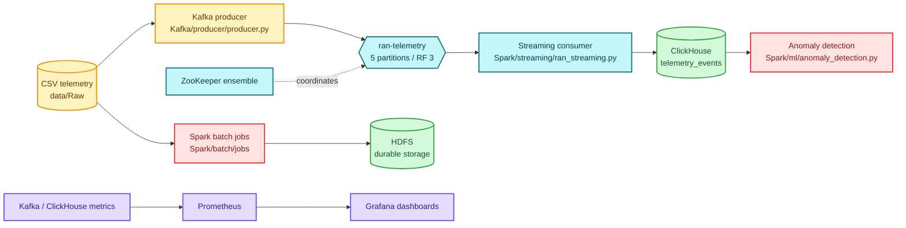

# Ran Intelligence Platform

<p align="center">
   <strong>A distributed telemetry platform for RAN-style data</strong><br>
   Stream raw network measurements into an observable path for storage, analytics, and anomaly detection.
</p>

<p align="center">
   
   
   
   
   
</p>

<p align="center">
   
</p>

> **Project status:** development and cluster-integration scaffold. The repository contains the platform layout, configuration, sample data, and core processing scripts; several bootstrap steps are still required before production operation.

## What This Project Does

Ran Intelligence Platform demonstrates an end-to-end pipeline for radio access network telemetry:

1. **Ingest** CSV measurements from LTE, NR, and GSM datasets.
2. **Normalize** column names and timestamp fields, infer the network type from each source filename, and group records by timestamp.
3. **Stream** grouped JSON events through a replicated Kafka cluster.
4. **Persist** streaming records in ClickHouse for fast analytical queries.
5. **Process** larger workloads with Spark and retain durable data in HDFS.
6. **Detect** unusual telemetry values with the ML anomaly detector.
7. **Observe** platform metrics through Prometheus and Grafana.

## Architecture



### Runtime topology

| Layer | Services | Purpose |
| --- | --- | --- |
| Coordination | `zookeeper1` - `zookeeper3` | Kafka coordination and ensemble state |
| Streaming | `kafka1` - `kafka5` | Five brokers/controllers, five partitions, replication factor three |
| Compute | `spark-master1`, `spark-master2`, `spark-worker1` - `spark-worker5` | Batch and distributed processing runtime |
| Data lake | `namenode1`, `namenode2`, `datanode1` - `datanode5`, `journalnode1` - `journalnode3` | HDFS namespace, blocks, and journal storage |
| Analytics | `clickhouse` | `ran_telemetry.telemetry_events` analytical table |
| Orchestration | `airflow` | Reserved orchestration service in the stack |
| Observability | `prometheus`, `grafana` | Metrics collection and dashboards |

## Repository Guide

```text
.
├── docker-stack.yml              # Docker Swarm service topology and volumes
├── .env.example                  # Environment defaults for local configuration
├── data/Raw/                     # LTE, NR, and GSM source CSV files
├── Kafka/producer/               # CSV loader and Kafka event producer
├── Spark/streaming/              # Containerized Kafka-to-ClickHouse consumer
├── Spark/batch/jobs/             # Place for Spark batch workloads
├── Spark/ml/                     # Statistical anomaly detection code and models
├── configs/                      # Kafka, ZooKeeper, Hadoop, Spark, and monitoring config
├── monitoring/                   # Grafana and Prometheus provisioning area
└── scripts/                      # Deployment, node labeling, and topic bootstrap helpers
```

### The main projects

#### `Kafka/producer`

`producer.py` reads one selected CSV (`CSV_FILE`) or every CSV in `DATA_DIR`. It cleans headers, maps common aliases such as `time` to `timestamp`, adds `network_type` and `source_file`, then publishes grouped JSON payloads to `ran-telemetry`. The default simulation delay is five seconds between timestamp groups.

#### `Spark/streaming`

`ran_streaming.py` consumes the topic from the earliest available offset, creates the ClickHouse table if it does not exist, and inserts telemetry rows into `telemetry_events`. The expected analytical fields are `timestamp`, `cell_id`, `region`, `signal_strength`, `temperature`, `latency_ms`, `packet_loss`, `availability`, `server_load_cpu`, and `server_load_mem`.

#### `Spark/ml`

`anomaly_detection.py` flags values more than three standard deviations from the mean for signal strength, latency, packet loss, and server CPU load. The resulting `is_anomaly` column is true when any monitored metric is anomalous. This is a baseline statistical detector, not a trained production model.

#### `Spark/batch`

The `jobs/` directory is the extension point for offline Spark transformations, aggregations, and HDFS-backed workloads. The current repository does not include a checked-in batch job yet.

#### `monitoring` and `configs`

Prometheus is configured to scrape Prometheus itself, Kafka endpoints, and ClickHouse. Grafana is provisioned as the dashboard UI. Cluster-specific settings are kept separate from application code under `configs/`.

## Quick Start

### 1. Prepare Docker Swarm

Run these commands on a Swarm manager:

```bash
docker swarm init                    # skip if this node is already a manager
docker node ls
./scripts/label-nodes.sh <node-1> <node-2> <node-3> <node-4> <node-5>
```

The label script assigns `node_id=1` through `node_id=5` in argument order. The stack uses those labels for service placement. A three-node cluster can label nodes 1-3, but services pinned to nodes 4 and 5 will remain pending until those nodes join.

### 2. Configure and deploy

```bash
cp .env.example .env
./scripts/deploy.sh
docker service ls
docker stack services ran-platform
```

`deploy.sh` runs `docker stack deploy -c docker-stack.yml ran-platform`. The stack uses the `ran-network` overlay network and named volumes for Kafka, ZooKeeper, HDFS, ClickHouse, Grafana, and Prometheus state.

### 3. Create the Kafka topic

Topic creation is intentionally separate because Kafka has `auto.create.topics.enable=false`:

```bash
./scripts/create-kafka-topic.sh
```

When running the helper outside the Kafka container, execute it in a container or shell that has `/usr/bin/kafka-topics.sh` and network access to `kafka1:9092`:

```bash
docker exec -it $(docker ps -q -f name=ran-platform_kafka1) \
   /usr/bin/kafka-topics.sh --create \
   --bootstrap-server kafka1:9092 \
   --replication-factor 3 --partitions 5 \
   --topic ran-telemetry --if-not-exists
```

### 4. Run the application containers

The stack provides the infrastructure services. Build and run the producer and streaming images from their project directories, or adapt `docker-stack.yml` to add them as services:

```bash
docker build -t ran-producer ./Kafka/producer
docker build -t ran-streaming ./Spark/streaming
```

For a local Python run, install the project-specific requirements first and point the process at the Swarm network:

```bash
pip install -r Kafka/producer/requirements.txt
KAFKA_BROKERS=kafka1:9092,kafka2:9092,kafka3:9092 \
DATA_DIR="$PWD/data/Raw" \
python Kafka/producer/producer.py
```

## Useful Endpoints

Only these services are published to the host by `docker-stack.yml`:

| Service | Address | Use |
| --- | --- | --- |
| ClickHouse HTTP | `http://localhost:8123` | SQL and health checks |
| ClickHouse native | `localhost:9000` | Native client protocol |
| Grafana | `http://localhost:3000` | Dashboards; default credentials are in `.env.example` |
| Prometheus | `http://localhost:9090` | Targets, queries, and metric status |

Kafka, Spark, HDFS, ZooKeeper, and Airflow are internal overlay-network services unless you add explicit port publishing.

## Configuration Reference

| Path | Controls |
| --- | --- |
| `docker-stack.yml` | Services, placement constraints, overlay network, mounts, published ports, and named volumes |
| `.env.example` | Kafka, HDFS, Spark, ClickHouse, monitoring, producer, and data-path defaults |
| `configs/zookeeper/zoo.cfg`, `configs/zookeeper/myid-*` | ZooKeeper ensemble settings and node IDs |
| `configs/kafka/kafka1.properties` - `kafka5.properties` | Broker IDs, listeners, partitions, replication, and storage |
| `configs/hadoop/` | HDFS namespace, replication, and worker lists |
| `configs/spark/` | Spark defaults, environment, and logging |
| `configs/prometheus/prometheus.yml` | Metrics scrape interval and targets |
| `monitoring/` | Grafana and Prometheus provisioning area |

## Data and Event Contract

Source files in `data/Raw/` include LTE 700/800/1800/2100, NR 1800/2100/3500, and GSM 900 measurements. Headers are normalized to lowercase snake case. The producer emits an envelope shaped like this:

```json
{
   "timestamp": "2023-10-08T06:00:00",
   "record_count": 3,
   "records": [{"timestamp": "2023-10-08T06:00:00", "network_type": "LTE"}],
   "network_types": ["LTE"],
   "source_files": ["Dataset_01_LTE_2100.csv"]
}
```

The streaming consumer currently expects a flat telemetry payload when inserting into ClickHouse. Keep this producer/consumer envelope difference in mind when extending the pipeline: either flatten `records` in the consumer or emit the fields expected by the ClickHouse insert path.

## Development Notes

- The stack is a development scaffold. Replace `latest` image tags with pinned versions before a repeatable deployment.
- Update credentials, storage paths, node labels, and network security before exposing services beyond a trusted development network.
- Topic creation, HDFS formatting/failover, Spark HA initialization, Airflow metadata initialization, and exporter installation still need bootstrap work.
- Prometheus targets in `configs/prometheus/prometheus.yml` use service names and ports; many applications need dedicated exporters for Prometheus-compatible metrics.
- Named volumes are local to the Swarm node where they are created. Plan shared or replicated storage for production.
- The sample data is suitable for pipeline development and demonstrations, not for operational decisions.

## Operations Cheat Sheet

```bash
docker stack services ran-platform
docker stack ps ran-platform --no-trunc
docker service logs -f ran-platform_prometheus
docker service logs -f ran-platform_grafana
docker service logs -f ran-platform_clickhouse
docker stack rm ran-platform
```

For a clean development reset, remove the stack first and then remove only the named volumes you intentionally want to discard. Persistent volumes contain cluster state and telemetry data.
