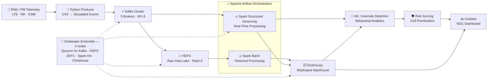

<p align="center">
  
#  📡 RAN BEHAVIORAL INTELLIGENCE BIG DATA PLATFORM


### *From Raw RAN Telemetry • To Real-Time Intelligence • To Proactive Operations*

<p align="center">

[](https://kafka.apache.org/)
[](https://spark.apache.org/)
[](https://hadoop.apache.org/)
[](https://clickhouse.com/)
[](https://www.docker.com/)
[](https://airflow.apache.org/)
[](https://grafana.com/)
[](https://python.org)
[](https://tailscale.com/)

</p>

---

[👥 Team Roster](#-meet-the-team) • [🏗️ System Architecture](#️-system-architecture--proposal) • [⚡ Cluster & HA Design](#-cluster-topology--ha-design) • [🚀 Quick Start](#-getting-started) • [📊 Dashboards](#-observability--dashboards)

---

## 🌟 Executive Summary & Core Pillars

This repository delivers an end-to-end, distributed **Big Data + AI platform** engineered to ingest, process, and analyze **real-time RAN (Radio Access Network) telemetry** across **5 physical machines**. The architecture streams cell/sector KPIs through a replicated Kafka bus, processes them via dual-master Spark (streaming + batch), persists raw history on HA HDFS, and serves curated analytics from a replicated ClickHouse warehouse — surfaced through live Grafana dashboards for NOC teams.

| 📡 DISTRIBUTED INGESTION | ⚙️ GENUINE HIGH AVAILABILITY | 🧠 STREAM + BATCH INTELLIGENCE | 📈 OPERATIONAL IMPACT |
|---|---|---|---|
| Real RAN telemetry streamed via 5 Kafka brokers (RF=3), one broker per physical node | HDFS Active/Standby NameNode + dual Spark Masters, both coordinated via Zookeeper automatic failover | Spark Structured Streaming for real-time anomaly detection + Spark Batch for historical cell profiling | Risk-scored, prioritized alerts on Grafana — moving NOC teams from reactive to proactive |

---

## 👥 Meet the Team

> 📸 *Add a team photo at `docs/assets/team_banner.jpeg` — replace this line once uploaded.*

### 🌟 Project Contributors & Roles

| Avatar / Role | Member Name | Core Responsibilities & Contributions |
|---|---|---|
| 🧠 Infrastructure & Architecture** | **Mohamed Abdelkader** | Full platform architecture, Docker Swarm management & deployment, HDFS Active NameNode, Kafka Broker-1, Spark Master-1 |
| 🐘 **HDFS & High Availability Engineer** | **Ahmed Mahmoud** | HDFS HA design, Standby NameNode, JournalNodes, ZKFC failover |
| ⚡ **Kafka & Streaming Engineer** | **Abdullah Mahmoud** | Kafka cluster configuration, ZooKeeper ensemble, streaming pipeline reliability |
| 🗄️ **Data & ClickHouse Engineer** | **Abd El-Rahman Sharawy** | ClickHouse replicated warehouse, Kafka broker ops, Spark worker tuning |
| 📊 **Monitoring & Orchestration Engineer** | **Amr Yasser** | Grafana dashboards, Prometheus metrics, Apache Airflow scheduling |

---

## 🏗️ System Architecture & Proposal


### 🔄 End-to-End Pipeline Workflow



### 📋 Detailed Stage Breakdown

1. **Data Source (RAN / PM Dataset)**
   - Real, open-source RAN performance measurements across **2G/GSM, 4G/LTE, and 5G/NR**.
   - KPIs: data volume, active users, RRC users, RB utilization, CQI, MIMO rank, radio unit & baseband energy.
   - Each cell/sector reports approximately every **15 minutes**.

2. **Simulated Streaming (Python Producer)**
   - Reads historical CSVs, parses timestamps, groups records, and replays them as live events — so historical data behaves like a real telemetry source.

3. **Distributed Ingestion (Apache Kafka)**
   - Topic `ran-telemetry`: **5 partitions, replication factor 3**, one broker per physical machine.
   - Broker loss triggers automatic leader election — producers/consumers keep running.

4. **Distributed Storage (Hadoop HDFS — HA)**
   - **Active + Standby NameNode**, 3 JournalNodes, automatic failover via ZKFC.
   - `dfs.replication = 3` across 5 DataNodes — the raw layer is never lost to a single node failure.

5. **Stream & Batch Processing (Apache Spark — Dual Master HA)**
   - `spark-master-1` / `spark-master-2` synchronized via Zookeeper Recovery Mode.
   - Streaming job: parses, validates, transforms KPIs, computes features, flags anomalies in real time.
   - Batch job: historical aggregation, cell profiling, feature engineering for model training.

6. **Analytical Warehouse (ClickHouse — Replicated)**
   - Two replicas using `ReplicatedMergeTree` over the shared Zookeeper ensemble.
   - Serves sub-second queries for dashboards and ad-hoc analysis.

7. **Behavioral Intelligence (Python / ML)**
   - Learns *per-cell* normal behavior instead of applying static thresholds.
   - Combines correlated KPI deviations into anomaly + degradation signals, then a prioritized risk score.

8. **Orchestration & Workflow (Apache Airflow)**
   - Schedules ingestion → processing → load pipelines with automatic retries on failure.

9. **Observability (Grafana + Prometheus)**
   - Live dashboards for cluster health, per-node resource usage, Kafka lag, Spark throughput, and RAN risk scores.

---

## 📁 Repository Structure

```text
ran-intelligence-platform/
├── 🐳 docker-stack.yml             # Full cluster definition — explicit Swarm placement per container
├── 🖼️ docs/assets/
│   ├── architecture-overview.png   #   System Architecture & Flow Proposal Diagram
│   └── team_banner.jpeg            #   Project Team Roster Banner
│
├── 📁 data/
│   └── Raw/
│       ├── LTE/
│       ├── NR/
│       └── GSM/
│
├── 📁 Kafka/
│   └── producer/
│       ├── producer.py             #   CSV → simulated streaming events
│       ├── Dockerfile
│       └── requirements.txt
│
├── 📁 Spark/
│   ├── streaming/
│   │   └── ran_streaming.py        #   Real-time anomaly detection job
│   ├── batch/
│   │   └── jobs/                   #   Historical aggregation & cell profiling
│   └── ml/
│       └── anomaly_detection.py    #   Behavioral models
│
├── 📁 configs/
│   ├── kafka/
│   ├── zookeeper/
│   ├── hadoop/                     #   core-site.xml, hdfs-site.xml
│   ├── spark/
│   └── clickhouse/                 #   zookeeper.xml, macros-ch1/2.xml
│
├── 📁 monitoring/
│   └── grafana/
│       └── dashboards/
│
├── 📁 scripts/
│   ├── label-nodes.sh              #   Assign node labels using real machine names
│   ├── sync-repo-to-nodes.sh       #   Sync configs to every node (bind mounts)
│   ├── init-hdfs.sh                #   One-time HDFS HA initialization
│   └── create-kafka-topic.sh
│
└── 📁 dags/
    └── ran_pipeline_dag.py         #   Airflow orchestration DAG
```

---

## ⚡ Cluster Topology & HA Design

To achieve real fault tolerance instead of a single point of failure, the platform runs on **5 physical machines** connected via **Tailscale mesh VPN**, orchestrated as a **Docker Swarm** (3 managers + 2 workers) with **explicit placement constraints on every container**.

```text
               ┌────────────────────────────┐
               │   Zookeeper Ensemble (3)   │  Quorum backbone
               └──────────────┬─────────────┘
                              │
        ┌─────────────────────┼─────────────────────┐
        ▼                     ▼                     ▼
     Kafka HA              HDFS HA               Spark HA
     RF = 3            Active/Standby NN       2 Masters (ZK)
        │                     │                     │
        ▼                     ▼                     ▼
  Broker Failure         NN Failover           Master Failover
  → leader election      → ZKFC promotes       → other master
    on remaining            standby               takes lead
    brokers
                              │
                              ▼
                    ClickHouse Replication
                     (2 replicas, ZK-backed)
```

> 💡 **Why this design works**: Kafka HA, HDFS HA, Spark HA, and ClickHouse replication all lean on the *same* 3-node Zookeeper quorum. That's a deliberate trade-off — it keeps the machine count at 5 instead of 8+, at the cost that losing Zookeeper quorum (2 of 3) would affect all four subsystems at once. Losing any *single* machine, by contrast, only degrades performance — it never takes the platform down.

### 🖥️ Node Roles

| Machine | Swarm Role | Services |
|---|---|---|
| `mohamed` | Manager (Leader) | Zookeeper-1, JournalNode-1, **Active NameNode**, ZKFC-1, Kafka-1, **Spark Master-1**, DataNode-1, Spark Worker-1 |
| `abdullah` | Manager | Zookeeper-2, JournalNode-2, **Standby NameNode**, ZKFC-2, Kafka-2, **Spark Master-2**, DataNode-2, Spark Worker-2 |
| `sharawy` | Manager | Zookeeper-3, JournalNode-3, Kafka-3, DataNode-3, Spark Worker-3 |
| `bodok` | Worker | Kafka-4, **ClickHouse-1**, DataNode-4, Spark Worker-4 |
| `amr` | Worker | Kafka-5, **ClickHouse-2**, Grafana, Airflow, Prometheus, DataNode-5, Spark Worker-5 |

---

## 📦 Scoped Configuration Reference

| Component | Config Files | Purpose |
|---|---|---|
| `configs/kafka/` | broker properties | Topic partitions, replication factor, listener config |
| `configs/hadoop/` | `core-site.xml`, `hdfs-site.xml` | Nameservice, JournalNode quorum, automatic failover |
| `configs/clickhouse/` | `zookeeper.xml`, `macros-ch1/2.xml` | Zookeeper connection + per-replica shard/replica identity |
| `configs/spark/` | master/worker env | Zookeeper recovery mode for dual-master HA |
| `configs/zookeeper/` | server config | 3-node ensemble backing all four HA subsystems |

---

## 🚀 Getting Started

### Option A: Manual Step-by-Step Deployment

**1. Prepare all 5 machines**

```bash
curl -fsSL https://get.docker.com | sh
sudo usermod -aG docker $USER && newgrp docker

curl -fsSL https://tailscale.com/install.sh | sh
sudo tailscale up
```

**2. Initialize the Swarm (from the leader node)**

```bash
docker swarm init --advertise-addr <leader-tailscale-ip>
# join the remaining 4 nodes with the printed tokens
```

**3. Label nodes & sync configs**

```bash
bash scripts/label-nodes.sh
bash scripts/sync-repo-to-nodes.sh
```

**4. Deploy the stack**

```bash
docker stack deploy -c docker-stack.yml ran-platform
docker stack ps ran-platform
```

**5. Initialize HDFS HA (one-time)**

```bash
bash scripts/init-hdfs.sh
```

**6. Create the Kafka topic**

```bash
kafka-topics.sh --bootstrap-server kafka1:9092 --create \
  --topic ran-telemetry --partitions 5 --replication-factor 3
```

**7. Start the producer & streaming job**

```bash
export KAFKA_BROKERS="kafka1:9092,kafka2:9092,kafka3:9092"
export DATA_DIR="./data/Raw"
python Kafka/producer/producer.py

spark-submit Spark/streaming/ran_streaming.py
```

### Option B: Automated Airflow Orchestration

1. Deploy the project folder into your Airflow `$AIRFLOW_HOME/dags/` directory.
2. Install worker dependencies:

```bash
pip install papermill pyspark kafka-python clickhouse-connect
```

3. Trigger the DAG:

```bash
airflow dags trigger ran_pipeline_dag
```

---

## 📊 Observability & Dashboards

Grafana provides the operational view of the platform:

| System | Tracked Metrics |
|---|---|
| ⚡ Kafka | Broker health, partition distribution, consumer lag, throughput, replication state |
| 🔥 Spark | Streaming throughput, processing latency, active jobs, worker health |
| 🐘 HDFS | DataNode health, storage utilization, replication status, NameNode state |
| 📡 RAN | Cell activity, RB utilization, user count, data volume, CQI, energy, anomaly count, risk score |

Access:

```text
Grafana     → http://<node-ip>:3000
Prometheus  → http://<node-ip>:9090
```

---

## 🧪 Fault Tolerance Testing

The goal isn't just "it runs" — it's proving that losing any single machine **degrades performance without taking the platform down**.

| Test | Command | Expected Result |
|---|---|---|
| Lose one Manager | `sudo systemctl stop docker` on a non-Leader node | Remaining managers (2 of 3) still hold quorum |
| HDFS Active NameNode fails | Stop `mohamed` | `namenode-standby` on `abdullah` becomes Active within seconds via ZKFC |
| Spark Master fails | Stop the node hosting the Active master | The other master takes over via Zookeeper Recovery |
| ClickHouse replica lost | Stop `bodok` or `amr` | The other replica stays up; data preserved on `ReplicatedMergeTree` tables |
| Kafka broker lost | Stop any node | Remaining 4 brokers stay up; partitions undergo automatic leader election |

---

### 🎓 RAN Behavioral Intelligence — NTI Big Data Final Project

*Crafted with ❤️ by Team Lead **Mohamed Abdelkader** and Team*
