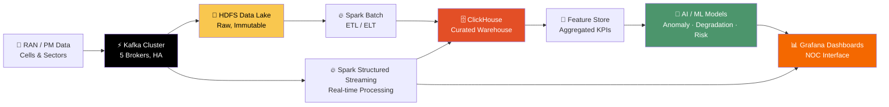
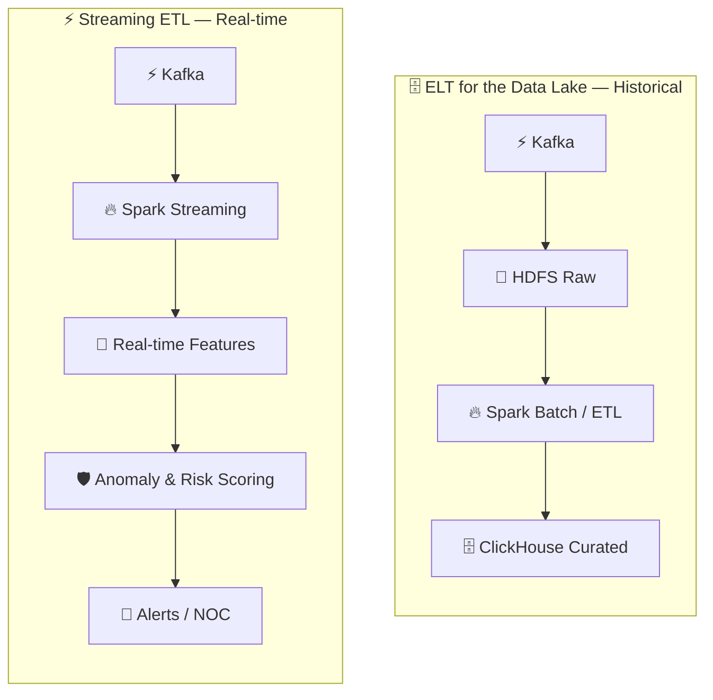
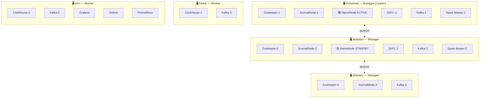
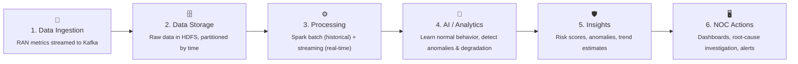

# 📡 RAN Behavioral Intelligence &<br>Predictive Network Operations Platform

### *From Raw RAN Data to Intelligent Network Decisions*

[](https://kafka.apache.org/)
[](https://hadoop.apache.org/)
[](https://spark.apache.org/)
[](https://clickhouse.com/)
[](https://www.docker.com/)
[](https://airflow.apache.org/)
[](https://grafana.com/)
[](https://www.python.org/)
[](https://tailscale.com/)

**Analyze · Detect · Predict · Prevent · Optimize**

[📖 The Story](#-the-story) • [⚠️ The Problem](#️-the-problem) • [💡 Our Solution](#-our-solution) • [🏗️ Architecture](#️-system-architecture) • [🖥️ Cluster](#️-cluster-topology--node-roles) • [🚀 Getting Started](#-getting-started) • [🧪 HA Testing](#-testing-fault-tolerance)

</div>
---

## 📖 The Story

Every cell tower in a modern telecom network is talking — constantly. Traffic volume, active users, RRC connections, resource block utilization, CQI, energy consumption, MIMO performance... thousands of signals a minute, from thousands of cells, all trying to tell you the same thing:

> *"Something is about to go wrong — if only someone was listening."*

Most Network Operations Centers aren't listening closely enough. They're drowning in static thresholds and generic alerts that treat every cell the same way, even though every cell behaves differently. By the time an alarm fires, the degradation has often already started affecting real users.

**This platform is our answer to that gap** — a vendor-neutral intelligence layer that sits on top of any existing RAN/OSS/NMS stack, turns raw performance data into real-time behavioral intelligence, and helps engineers act *before* failure happens instead of after.

---

## ⚠️ The Problem

Telecom networks generate massive amounts of performance data — and almost none of it is being used the way it should be.

<table>
<tr>
<td width="55%">
**Every cell reports KPIs like:**
- 📶 Traffic Volume
- 👥 Active Users
- 🔗 RRC Users
- 📡 RB Utilization
- 📊 CQI (Channel Quality Indicator)
- ⚡ Energy Consumption
- 📈 MIMO Performance
- ...and dozens more
</td>
<td width="45%">
> **🚩 Key Challenges**
> 1. Static thresholds are not enough
> 2. KPI behavior is different for every cell
> 3. KPIs are correlated, not independent
> 4. Too many alerts — engineers are overwhelmed
> 5. Degradation happens *before* failure
> 6. Hard to know which cells to investigate first

</td>
</tr>
</table>
> 💬 **The need:** AI-driven, cell-aware, *explainable* intelligence that helps NOC teams act proactively — not reactively.

---

## 💡 Our Solution

An end-to-end Big Data + AI platform delivering real-time **and** historical RAN intelligence:

```
📡 Ingestion  →  🗄️ Raw Data Lake  →  ⚙️ Processing  →  📊 Cell Profiling  →  🧠 AI/ML Analytics  →  🛡️ Risk Scoring  →  🖥️ Dashboards & Alerts
  (Streaming)      (HDFS, immutable)   (Batch + Stream)   (per-cell baselines)  (anomaly/degradation)  (prioritization)     (NOC interface)
```

> 🎯 **MVP scope:** anomaly & degradation detection. Future iterations will extend into failure *prediction* using historical incident data.

---

## 🏗️ System Architecture

> ⚠️ **Architecture note:** the original concept used **Hive** as the warehouse layer. We replaced it with **ClickHouse** during implementation — Hive Metastore was a single point of failure with no straightforward HA story, while ClickHouse gives us native replication via `ReplicatedMergeTree` over our existing Zookeeper ensemble. Everything below reflects what's actually running, not the original pitch.

<div align="center">

<sub>Original concept poster — kept for reference. See the live data-flow and HA diagrams below for the as-built architecture.</sub>
</div>
### 🔄 End-to-End Data Flow (as-built)



### ⚙️ Processing Strategy (ETL vs. ELT)



> 💡 Raw data is **always preserved in HDFS**, replicated 3×. This means we can always reprocess history or engineer new features later without re-ingesting anything.

---

## 🧰 Technology Stack

| Layer | Technology | Why |
|---|---|---|
| 🌐 **Data Ingestion** |  | High-throughput, real-time data ingestion, 5 brokers |
| 🐘 **Storage** |  | Distributed, HA storage for raw and processed data |
| 🔥 **Processing** |  | Batch, ETL, and stream processing — dual-master HA |
| 🗄️ **Data Warehouse** |  | Replicated analytical layer, sub-second query latency |
| 🔄 **Orchestration** |  | Pipeline scheduling with automatic retries |
| 🧠 **AI / ML** |  | scikit-learn, PySpark MLlib, XGBoost |
| 📊 **Visualization** |  | Real-time dashboards and alerting |
| 🐳 **Orchestration/Infra** |  | 5-node HA cluster over a Tailscale mesh VPN |

---

## 🖥️ Cluster Topology & Node Roles

The whole stack runs on **5 physical machines** connected via **Tailscale** and orchestrated as a **Docker Swarm** (3 managers + 2 workers), with **explicit placement constraints on every container** — nothing is scheduled randomly, and every failure scenario is testable on purpose.



| Machine | Swarm Role | Services |
|---|---|---|
| `mohamed` | Manager (Leader) | Zookeeper-1, JournalNode-1, **Active NameNode**, ZKFC-1, Kafka-1, **Spark Master-1**, DataNode-1, Spark Worker-1 |
| `bodok` | Manager | Zookeeper-2, JournalNode-2, **Standby NameNode**, ZKFC-2, Kafka-2, **Spark Master-2**, DataNode-2, Spark Worker-2 |
| `abdullah` | Manager | Zookeeper-3, JournalNode-3, Kafka-3, DataNode-3, Spark Worker-3 |
| `sharawy` | Worker | Kafka-4, **ClickHouse-1**, DataNode-4, Spark Worker-4 |
| `amr` | Worker | Kafka-5, **ClickHouse-2**, Grafana, Airflow, Prometheus, DataNode-5, Spark Worker-5 |

> **Deliberate trade-off:** the Zookeeper ensemble (3 replicas) coordinates *four* subsystems — Kafka, HDFS ZKFC, Spark HA, and ClickHouse. That's a conscious choice to keep the machine count at 5, with the known cost that losing quorum (2 of 3) impacts all four systems at once.

---

## 👥 Meet the Team

| Role | Member | Core Responsibilities |
|---|---|---|
|  Infrastructure Owner** | **Mohamed** | Full architecture design, Docker Swarm management, HDFS HA (Active NameNode + JournalNode-1 + Zookeeper-1), Kafka Broker-1, Spark Master-1 |
| 🐘 **HDFS Standby & Failover Engineer** | **Bodok** | HDFS Standby NameNode, ZKFC-2, JournalNode-2, Zookeeper-2, Kafka Broker-2, Spark Master-2 |
| ⚡ **Kafka & Streaming Engineer** | **Abdullah** | Zookeeper-3, JournalNode-3, Kafka Broker-3, Spark Worker-3 |
| 🗄️ **ClickHouse & Data Engineer** | **Sharawy** | ClickHouse Replica-1, Kafka Broker-4, DataNode-4, Spark Worker-4 |
| 📊 **Monitoring & Orchestration Engineer** | **Amr** | Grafana, Apache Airflow, Prometheus, ClickHouse Replica-2, Kafka Broker-5 |

---

## 🚀 Getting Started

### Prerequisites (on all 5 machines)

```bash
# Docker
curl -fsSL https://get.docker.com | sh
sudo usermod -aG docker $USER && newgrp docker

# Tailscale
curl -fsSL https://tailscale.com/install.sh | sh
sudo tailscale up
```

### Cluster Setup (run from `mohamed` only)

```bash
git clone <repo-url> /opt/ran-intelligence-platform
cd /opt/ran-intelligence-platform

# 1. Initialize Swarm
docker swarm init --advertise-addr <mohamed-tailscale-ip>

# 2. Join the remaining 4 machines using the join tokens printed above
# On each node: docker swarm join --advertise-addr <node-ip> --token <TOKEN> <mohamed-ip>:2377

# 3. Distribute node labels
bash scripts/label-nodes.sh

# 4. Sync configs to every machine (required for ClickHouse bind mounts)
bash scripts/sync-repo-to-nodes.sh

# 5. Deploy the full stack
docker stack deploy -c docker-stack.yml ran-platform

# 6. Initialize HDFS HA (one time only)
bash scripts/init-hdfs.sh
```

### Verify

```bash
docker node ls
docker stack ps ran-platform
```

---

## 🧪 Testing Fault Tolerance

The goal isn't "it runs" — it's proving that losing any single machine **degrades performance without taking the platform down**.

| Test | Command | Expected Result |
|---|---|---|
| Lose one Manager | `sudo systemctl stop docker` on a non-Leader node | Remaining managers (2 of 3) still hold quorum |
| HDFS Active NameNode fails | Stop `mohamed` | `namenode-standby` on `abdullah` becomes Active within seconds via ZKFC |
| Spark Master fails | Stop the node hosting the Active master | The other master takes over via Zookeeper Recovery |
| ClickHouse replica lost | Stop `bodok` or `amr` | The other replica stays up; data is preserved on `ReplicatedMergeTree` tables |
| Kafka broker lost | Stop any node | Remaining 4 brokers stay up; partitions undergo automatic leader election |

---

## 📊 How It Works — End to End



<div align="center">
**From Reactive Operations → To Proactive & Autonomous Operations**

</div>
---

## 🌟 Benefits & Impact

- ✅ Detect issues **before** users are impacted
- ✅ Reduce network downtime and complaints
- ✅ Prioritize NOC workload with risk scoring
- ✅ Improve network efficiency & resource utilization
- ✅ Lower OPEX through intelligent automation
- ✅ Scalable, vendor-neutral, and genuinely fault-tolerant — not just on paper
<div align="center">
### 🌟 Better Network. Happier Users. Smarter Operations. 🌟

</div>
---

## 📁 Repository Structure

```
ran-intelligence-platform/
├── 🐳 docker-stack.yml             # Full cluster definition — explicit Swarm placement per container
├── 📄 README.md
├── 📄 .env.example
│
├── 📁 docs/
│   ├── assets/
│   │   └── architecture-overview.png   #   this project's concept poster
│   ├── architecture/                   #   system / network / data-flow diagrams
│   ├── setup/                          #   tailscale.md, docker.md, cluster-setup.md
│   └── decisions/                      #   architecture-decisions.md
│
├── 📁 configs/
│   ├── clickhouse/                  #   zookeeper.xml, macros-ch1/2.xml
│   ├── hadoop/                      #   core-site.xml, hdfs-site.xml
│   ├── kafka/
│   └── spark/
│
├── 📁 scripts/
│   ├── label-nodes.sh               #   assign node labels using real machine names
│   ├── sync-repo-to-nodes.sh        #   sync configs to every node (bind mounts)
│   └── init-hdfs.sh                 #   one-time HDFS HA initialization
│
├── 📁 streaming/                    #   Spark Structured Streaming jobs
├── 📁 batch/                        #   Spark batch jobs
├── 📁 ml/                           #   anomaly detection / degradation / risk scoring models
└── 📁 monitoring/
    └── grafana/                     #   dashboard JSON exports
```

---

<div align="center">
### 🎓 RAN Behavioral Intelligence & Predictive Network Operations Platform

*Built by Mohamed Abdelkader and Team*

</div>
